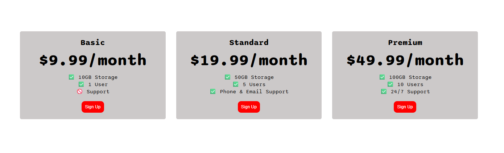

💳 Flexbox Pricing Table – HTML & CSS Project

This is a responsive pricing table built using HTML and CSS Flexbox.

🔧 Technologies Used
- HTML5
- CSS3 (Flexbox & Media Queries)
- Google Fonts

📌 Features
- Three-column pricing layout
- Responsive design for smaller screens
- Clean and modern UI
- Beginner-friendly code structure

🌐 Live Demo
👉 https://kaushikshivam-stack.github.io/flexbox-pricing-table/

🙌 What I Learned
- Flexbox layout concepts
- Media queries for responsiveness
- Building real-world UI components

## 📸 Project Screenshot

⭐ This project helped me strengthen my CSS fundamentals.
